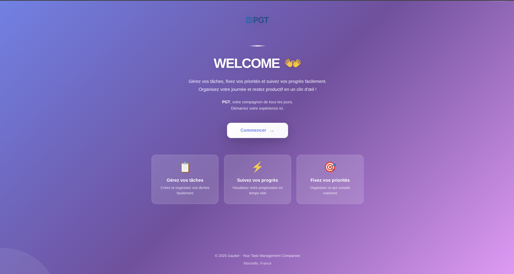
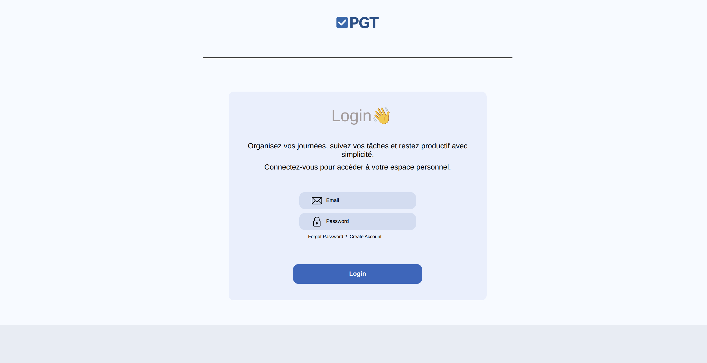
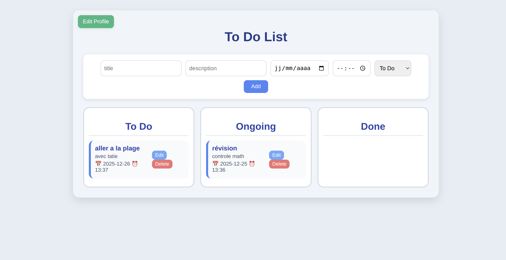

# e-toto-website

**e-toto-website** est notre premier projet fullstack développé en équipe de trois.  
L'objectif : proposer une application simple et intuitive pour créer, organiser et gérer ses tâches du quotidien.  
Les tâches peuvent être déplacées facilement via un système de **drag & drop**, comme sur Trello, avec trois colonnes : **To Do**, **Ongoing**, **Done**.

---

## Fonctionnalités principales

- Page d'accueil qui redirige vers le Login  
- Authentification complète (Login & Signin)  
- Gestion des tâches : création, modification et suppression  
- Organisation en colonnes : *To Do*, *Ongoing*, *Done*  
- Drag & Drop fluide et ergonomique  
- Interface simple, claire et intuitive  

---

## Aperçus du projet

### Page d'accueil (Home)


### Page Login / Signin


### Tableau de bord (Task Manager)


---

## Installation et lancement.

### Prérequis

Avant de commencer, assure-toi d'avoir installé :
- [Node.js](https://nodejs.org/) (v16 ou supérieur)
- [Docker](https://www.docker.com/get-started) & Docker Compose
- [Git](https://git-scm.com/)

### Étapes d'installation

**1. Cloner le dépôt**
```bash
git clone https://github.com/gotexee/e-toto-website.git
```

**2. Se diriger dans le dossier**
```bash
cd e-toto-website
```

**3. Lancer l'application avec Docker**
```bash
docker compose up --build
```

Note : Le flag `--build` reconstruit les images Docker. Pour les lancements suivants, tu peux simplement utiliser `docker compose up`.

**4. Accéder à l'application**

Une fois les conteneurs lancés, l'application est accessible à l'adresse suivante :

**http://localhost:3000**
